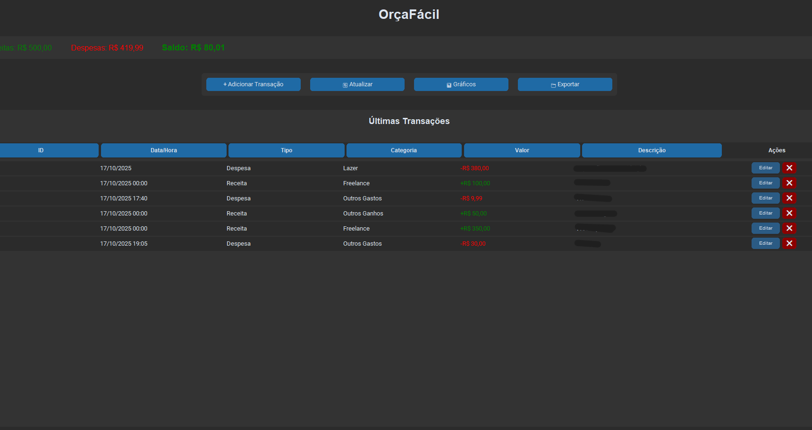
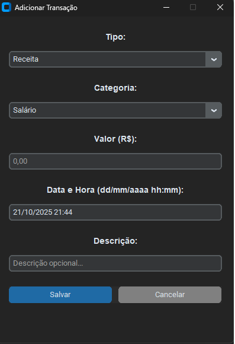
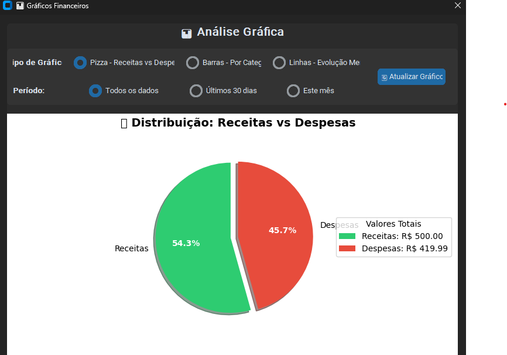
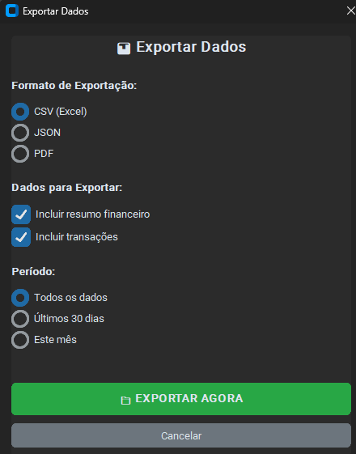

# 💰 OrçaFácil

O **OrçaFácil** é uma aplicação web desenvolvida em **Python + Flask**, criada para ajudar no **controle de finanças pessoais**, permitindo registrar entradas, saídas e visualizar o histórico de forma simples, direta e organizada.

---

## 🚀 Funcionalidades

- ✅ Registro de transações financeiras (entrada e saída)  
- ✅ Visualização do histórico de lançamentos  
- ✅ Interface simples e intuitiva  
- ✅ Banco de dados local (SQLite)  
- ✅ Categorias personalizadas  

---

## 🛠️ Tecnologias Utilizadas

**Backend**
- Python 3.14
- Flask (em manutenção)

**Banco de Dados**
- SQLite

**Frontend**
- HTML
- CSS
- JavaScript


---

## 📁 Estrutura do Projeto

```
FinanceTracker/
├── screenshots/ # Imagens do app
├── src/ # Código principal
│ └── app.py # Aplicação Flask
├── static/ # CSS, JS e imagens
├── templates/ # HTML
├── database.db # Banco SQLite
├── requirements.txt # Dependências
└── README.md
```

---

## 📦 Requisitos

Antes de rodar o projeto, instale as dependências:

```bash
pip install -r requirements.txt
pip install flask


```

## ▶️ Como Executar o Projeto

Clone o repositório:

```bash
git clone https://github.com/henriqm22/FinanceTracker.git
cd FinanceTracker

```

Execute o programa (no terminal): 

```bash
python app.py

```

Clique sobre o link do endereço IP que irá aparecer, ou cole no seu navegador: 

```bash

http://127.0.0.1:5000/

```

Você também pode executar a versão GUI (sem flask) na opção RUN do arquivo MAIN.PY


---


## 🖼️ Screenshots


Tela inicial do OrçaFácil:



Adicionando uma nova transação:




Visualizando Gráficos:




Exportando Dados:




---

## ✨ Melhorias Futuras

- Incluir funcionalidade de Login
- Criação de app mobile
- Melhorias no código Flask

---

## 📄 Licença

Este projeto está licenciado sob a [MIT License](LICENSE).


